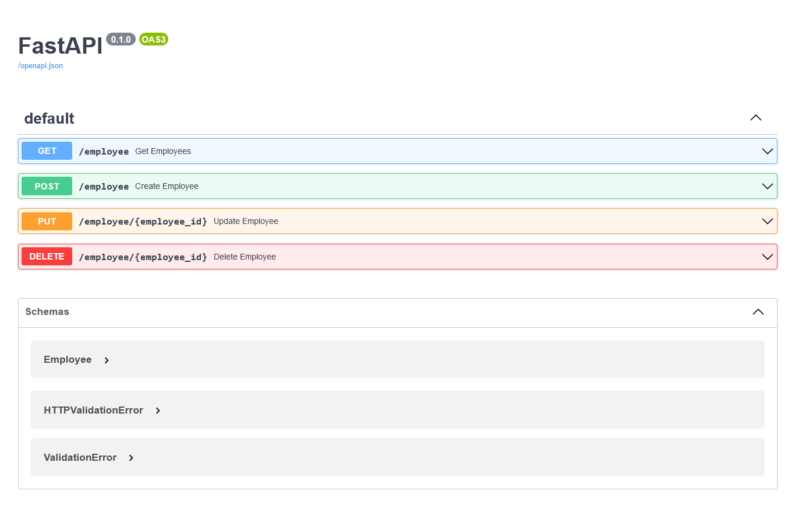

# FastAPI MongoDB CRUD


This repository contains a simple implementation of a RESTful API using the FastAPI framework in Python. The API allows CRUD operations (Create, Read, Update, Delete) on employee data stored in a MongoDB database. The code utilizes the Pydantic library for data validation and MongoDB's PyMongo driver for database interactions. The API provides endpoints for retrieving all employees, creating a new employee, updating an existing employee, and deleting an employee by ID.

## Installation
Open command prompt and create new environment
```
conda create -n your_env_name python = (any_version_number > 3.10)
```
Then Activate the newly created environment
```
conda activate your_env_name
```
Clone the repository using `git`
```
git clone https://github.com/Prakashdeveloper03/FastAPI-MongoDB-CRUD.git
```
Change to the cloned directory
```
cd <directory_name>
```
Then install all requirement packages for the app
```
pip install -r requirements.txt
```
Then, Run the `main.py` script
```
python main.py
```
## 📷 Screenshots
